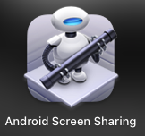
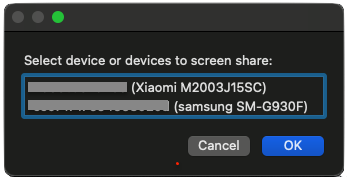
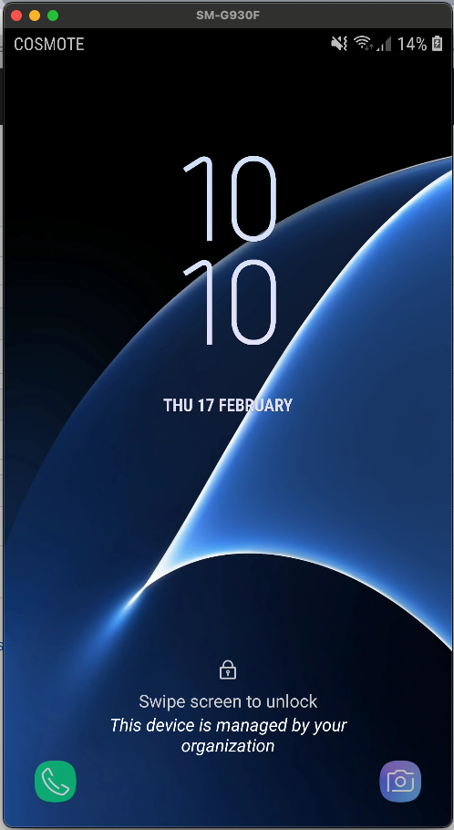

# mac-scrcpy-app
Launcher application for [`scrcpy`](https://github.com/Genymobile/scrcpy) tool with the use of automator scripts.

## Features
- Display UI selector for devices to select one or more
- Selector is skipped for a single device connected to adb, contributed by **@[grantland](https://github.com/grantland)**
- Display error dialog if no device found

## Install
1. Install screen copy tool (see [requirements](#requirements))
2. Use the [DMG](#dmg) or manually setup the code via automator (see [manual](#manual))

### Requirements
Installation of [`scrcpy`](https://github.com/Genymobile/scrcpy)
```
brew install scrcpy
```
For detailed instructions related to scrcpy installation see Genymobile page [here](https://github.com/Genymobile/scrcpy#macos).

### DMG
Download the latest [Android.Screen.Sharing.dmg](https://github.com/madlymad/mac-scrcpy-app/releases/latest/download/Android.Screen.Sharing.dmg) and install it as most applications in mac.

### Manual
You can create your own application for the provided code at [`scripts`](https://github.com/madlymad/mac-scrcpy-app/tree/main/scripts) folder by following the logic and details provided at my medium article [Mirror your Android screen to MacOS](https://mandostam.medium.com/mirror-your-android-screen-to-macos-b72804d652bd). Code provided at the article is not in sync with latest versions.

## Use
Launch the application via Application icon



Select preferred device



Screen sharing starts via screen copy tool



## Releases
https://github.com/madlymad/mac-scrcpy-app/releases
